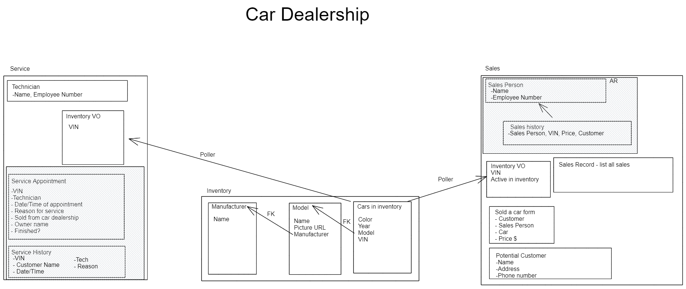

# CarCar

Team:

Bryan Kleinberg - Service
Klaudia Pietrzak - Sales

## Design

Please click the link above to go to the underlying design philosphy of this project.

## Service microservice

Three models were needed to compose a service mircoservice in this project: ServiceAppointment, Technician, and InvVO. InvVO is a VO that contains the VIN and VIP status from the avaliable cars in the inventory microservice. Additionally, it will contain vehicle information even on sold cars as a perpetual database. This information is generated via a poller to the Inventory microservice API. The ServiceAppointment model allows for database storage of all service appointments either completed or still active.

## Sales microservice

Sales microservice has 4 models: Salesman model to create a new employee with unique employee number, Customer model to create profile for potencial buyer, Sale model which records all completed transacions and Inventory model which polls data from Inventory microservice with unique VIN number.

Sale model depends on all three remianing models. It will only contain accesible automobiles (by VIN) which are available in Inventory (not sold).

## Stretch goals to update project
Fix address
Fix phone number
Fix pagination
Make dynamic search bar instead of an input box that filters
Add dollar sign in "Create sale record"
